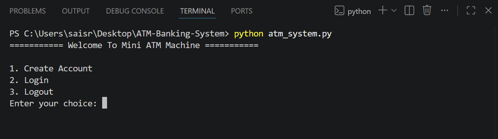
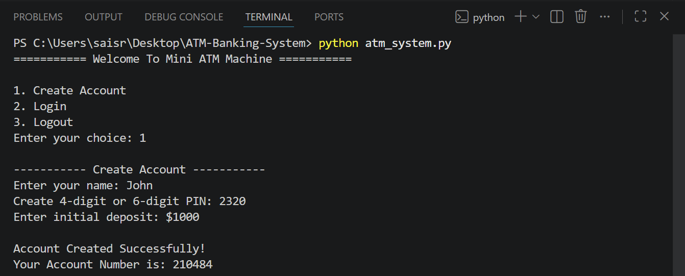
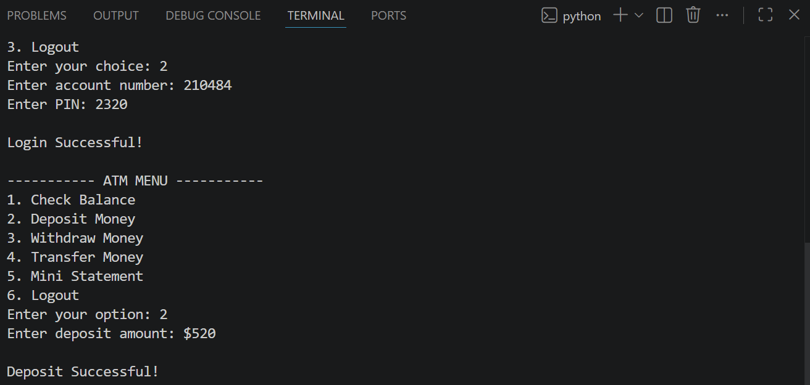
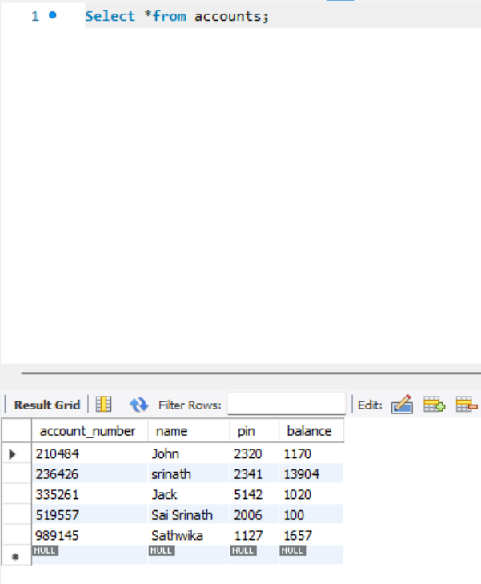
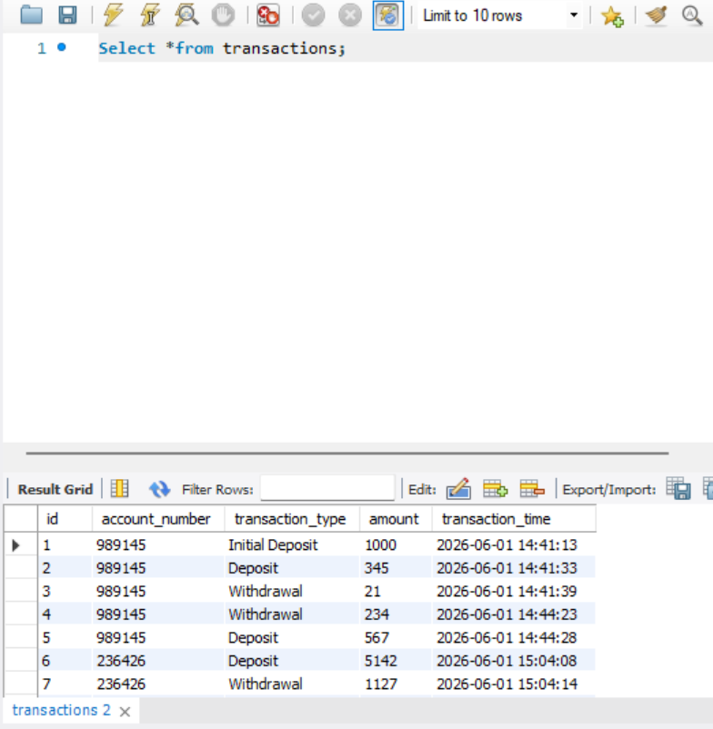

# 🏦 ATM Banking System Using Python & MySQL

A secure console-based ATM Banking System built using Python and MySQL that simulates real-world banking operations. The project provides account management, secure authentication, fund transfers, transaction tracking, and database integration.

---

## 🚀 Features

✅ Create New Bank Account
✅ Secure PIN Authentication (4 or 6 digits)
✅ Balance Inquiry
✅ Deposit Money
✅ Withdraw Money
✅ Transfer Funds Between Accounts
✅ Mini Statement / Transaction History
✅ MySQL Database Integration
✅ Transaction Logging
✅ Input Validation & Error Handling

---

## 🛠️ Technologies Used

| Technology | Purpose |
|------------|---------|
| Python | Core Programming |
| MySQL | Database Management |
| MySQL Connector | Python-MySQL Integration |
| SQL | Data Storage & Queries |

---
## 🗄️ Database Schema

### Accounts Table

| Column | Type |
|----------|---------|
| account_number | INT |
| name | VARCHAR(100) |
| pin | VARCHAR(10) |
| balance | FLOAT |

### Transactions Table

| Column | Type |
|----------|---------|
| Id | INT |
| account_number | INT |
| transaction_type | VARCHAR(50) |
| amount | FLOAT |
| transaction_time | DATETIME |

---

## ⚙️ Installation

### Clone Repository

```bash
git clone https://github.com/srinath0509-ops/ATM-Banking-System-Python-MySQL.git
```

### Install Dependencies

```bash
pip install -r requirements.txt
```

### Create Database

Open MySQL and execute:

```sql
SOURCE database_setup.sql;
```

Or copy and run the SQL commands from `database_setup.sql`.
---

## 📸 Screenshots

### Main Menu


### Create Account


### Deposit Money


### Transfer Money


### Mini Statement


## Database Records

### Accounts Table


### Transactions Table


---

## 🎯 Learning Outcomes

- Python Programming
- MySQL Database Integration
- CRUD Operations
- Authentication Systems
- Transaction Management
- Error Handling
- Database Design

---

## 🔮 Future Enhancements

- GUI using Tkinter
- Password Encryption
- Admin Dashboard
- Account Lock Feature
- Email Notifications

---

## 👨‍💻 Author

**Sai Srinath**

B.Tech CSE | GITAM University Hyderabad

GitHub: https://github.com/srinath0509-ops
